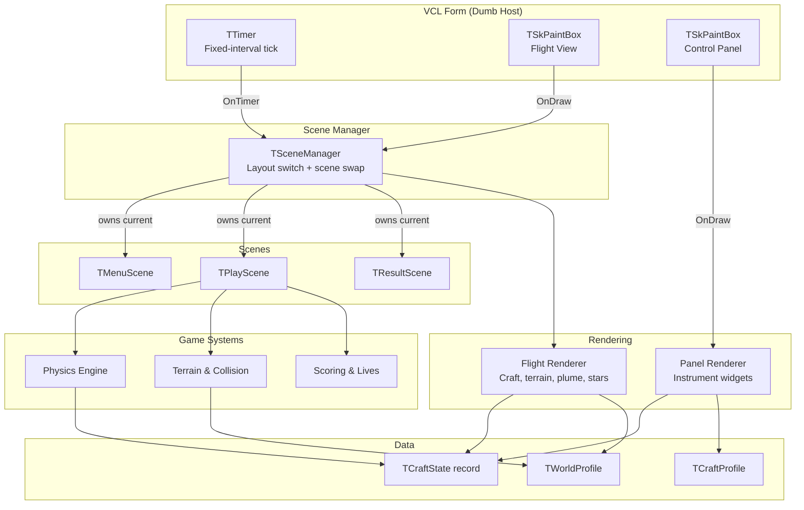
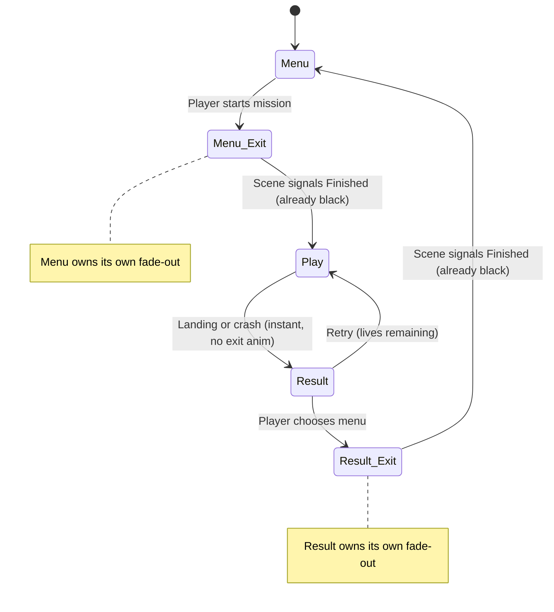
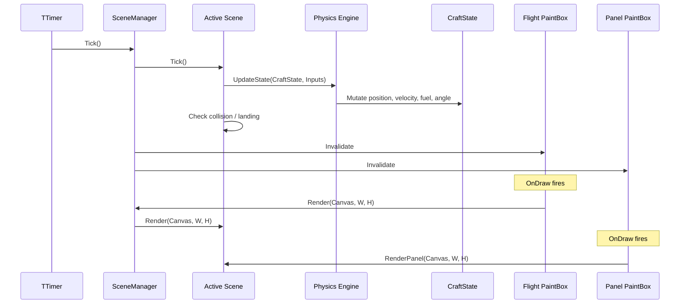
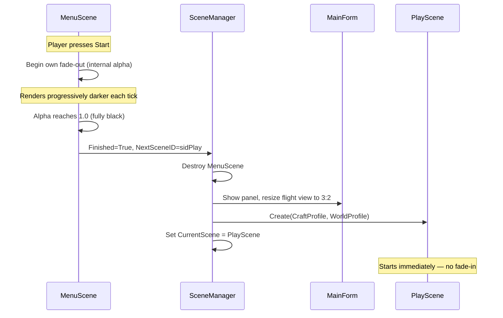
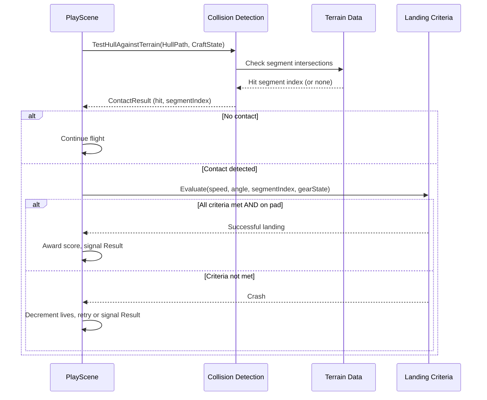

# Design Document: Lunar Lander

## Overview

A 2D physics-based lunar lander game built with Delphi CE 12.2 (VCL) and Skia4Delphi. The player pilots a spacecraft to land on designated pads while managing main thrust fuel and RCS fuel for rotation. The game uses a scene manager pattern where the form is a minimal host — all logic, rendering, and state management live in scene classes. Two TSkPaintBox surfaces provide the rendering targets: a fixed-width control panel on the left and a 3:2 aspect-ratio flight view on the right.

The V1 scope delivers a complete single-craft, single-world experience with a scene system (menu, play, result), full control panel instrumentation, Newtonian physics with angular velocity rotation, terrain collision, landing validation, scoring, and a 3-life system.

## Architecture

### Key Architectural Decisions

- **Form as dumb host**: The main form owns the timer, two paint boxes, and forwards input. It has no game logic.
- **Sim tick separate from render**: The timer fires a Tick call on the scene manager, then invalidates both paint boxes. Physics and rendering are decoupled.
- **Physics doesn't know about drawing**: The physics engine updates a state record; the renderer reads it.
- **Scene manager controls layout**: It shows/hides the panel and resizes surfaces when swapping scenes. Scenes own their own exit/entrance animations — the manager has no transition state machine.

## Scene System

### Layout Modes

| Mode | Panel Visible | Flight View | Used By |
|------|--------------|-------------|---------|
| Full-window | No | Fills entire client area | Menu scene |
| Panel + Flight | Yes (fixed ~220px) | Right side, 3:2 aspect, letterboxed | Play scene, Result scene |

### Transition Rules

- **Scenes own their exit.** Each scene handles its own exit animation (fade, wipe,
  instant cut — whatever suits it). The scene only signals `Finished` once it's
  fully done and rendering black/nothing.
- **Scene manager is simple.** It just checks the flag, destroys the old scene,
  reconfigures layout, and creates the new scene. No transition state machine,
  no alpha tracking in the manager.
- **Layout reconfiguration is invisible** because the screen is guaranteed black
  when the manager performs it.
- **Incoming scenes own their entrance.** A new scene can fade in, or just appear
  immediately — that's its own decision on first render.

**Specific transitions:**
- Menu → Play: menu fades itself to black → signals Finished → manager shows panel,
  resizes flight view → play scene starts immediately (no fade-in)
- Play → Result: play signals Finished instantly (no exit anim) → result takes over,
  panel stays with frozen gauges
- Result → Menu: result fades itself to black → signals Finished → manager hides
  panel, resizes flight view → menu fades itself in

## Components and Interfaces

### Component 1: Scene Manager

**Purpose**: Owns the active scene and swaps scenes when one signals completion. Controls layout mode.

**Responsibilities**:
- Maintain reference to the current scene
- Check `Finished` flag each tick
- When finished: destroy current scene, reconfigure layout based on `NextSceneID`, create new scene
- Reconfigure form layout (panel visibility, surface sizing) between scenes
- Forward Tick, Render, and HandleInput calls to the current scene

Does NOT manage transition animations — scenes own their own exit/entrance visuals.

### Component 2: Menu Scene

**Purpose**: Title screen with craft/mission selection and autopilot demo background.

**Responsibilities**:
- Render title/UI elements
- Run autopilot demo (random craft, physics ticking, respawn on crash/offscreen)
- Accept input for "Start" action
- Own its exit animation (fade to black)
- Signal `Finished` only after fully black, with `NextSceneID = sidPlay`
- Own its entrance animation (fade in from black when created)

### Component 3: Play Scene

**Purpose**: Core gameplay — physics simulation, terrain rendering, input handling, landing/crash detection.

**Responsibilities**:
- Initialize craft state from craft profile and world profile
- Run physics tick each frame (gravity, thrust, RCS, position integration)
- Detect collision with terrain segments
- Evaluate landing criteria (speed, angle, pad, gear state)
- Track lives and trigger retry or result
- Provide craft state to panel renderer each frame

### Component 4: Result Scene

**Purpose**: Display outcome (successful landing or crash), score, and navigation options.

**Responsibilities**:
- Show landing/crash outcome with final stats
- Display scoring breakdown
- Offer retry (if lives remain), next level, or return to menu
- Panel remains visible with frozen gauge values from moment of outcome
- Own its exit animation (fade to black) when returning to menu
- Signal `Finished` only after fully black

### Component 5: Physics Engine

**Purpose**: Pure calculation of craft state updates per tick. No rendering, no input awareness.

**Responsibilities**:
- Apply gravity to vertical velocity
- Apply thrust in facing direction scaled by throttle level (when Thrust > 0 and fuel > 0)
- Deplete fuel proportional to throttle level
- Apply RCS angular acceleration (when rotating and RCS fuel > 0)
- Integrate angular velocity into angle
- Integrate velocity into position
- Deplete fuel and RCS fuel at configured burn rates
- Optionally apply SAS auto-damping (costs RCS fuel)

### Component 6: Terrain & Collision

**Purpose**: Represent the world's terrain polyline, identify landing pads, and perform collision detection.

**Responsibilities**:
- Store terrain as an array of point segments
- Identify pad segments (flat, designated, with point values)
- Test craft hull segments against terrain segments (line-line intersection)
- Report which segment was hit and whether it's a pad
- Calculate altitude above nearest terrain (for altimeter)

### Component 7: Panel Renderer

**Purpose**: Draw the control panel surface with instrument widgets appropriate to the active craft.

**Responsibilities**:
- Draw static panel background (brushed metal / dark composite bitmap)
- Iterate the craft profile's instrument list and render each widget
- Read craft state for gauge values (fuel, RCS, velocity, altitude, angle)
- Show craft-specific system indicators (SAS on/off, gear deployed/retracted)

### Component 8: Flight Renderer

**Purpose**: Draw the flight view — terrain, craft, effects, and background.

**Responsibilities**:
- Draw star background via SkSL fragment shader (procedural stars with twinkling)
- Draw terrain polyline with highlighted pad segments
- Draw craft hull (rotated/translated ISkPath)
- Draw thrust plume effect (simple Skia draws — semi-transparent shapes, flickering size)
- Draw RCS puff effects (simple Skia draws — small translucent dots at hull edges)
- Draw fade overlay during transitions (black rect with alpha)
- Maintain 3:2 aspect ratio with letterboxing

**Starfield shader (SkSL):**
- Fragment shader drawn as a fullscreen quad behind everything else
- Procedurally generates star positions from a grid hash (no bitmap, resolution-independent)
- `uTime` uniform drives per-star twinkle (subtle brightness oscillation via sin)
- Runs every frame (cheap — GPU fragment ops only, no CPU per-star work)
- Also used in menu scene background (same shader, same effect)

**Plumes (simple Skia path draws for V1):**
- Main engine plume: semi-transparent triangles/circles below nozzle, random size variation per frame for flicker
- RCS puffs: small translucent dots/short lines at hull edges when rotating
- V2 candidate: replace with SkSL shaders for procedural turbulent flame

### Component 9: Scoring & Lives

**Purpose**: Track score accumulation and remaining lives.

**Responsibilities**:
- Award points based on pad difficulty (smaller pad = more points)
- Bonus for remaining fuel
- Track 3 lives per level
- Determine when game-over occurs (0 lives)

## Data Models

### TCraftState

The real-time mutable state of the craft during gameplay. Updated by the physics engine each tick.

| Field | Type | Description |
|-------|------|-------------|
| X, Y | Single | World position |
| VX, VY | Single | Velocity components |
| Angle | Single | Facing angle (0 = up, CW positive) |
| AngularVel | Single | Angular velocity (persists, no damping) |
| Fuel | Single | Main thruster fuel remaining |
| RCSFuel | Single | RCS fuel remaining |
| Thrust | Single | Current throttle level (0.0 = off, 1.0 = full) |
| RotatingLeft | Boolean | RCS firing left |
| RotatingRight | Boolean | RCS firing right |
| GearDeployed | Boolean | Landing gear state |
| SASActive | Boolean | Stability assist active |
| Alive | Boolean | Craft not yet crashed |

### TCraftProfile

Static definition of a craft's characteristics. Loaded once, never mutated during play.

| Field | Type | Description |
|-------|------|-------------|
| Name | String | Display name |
| HullPath | ISkPath | Vector outline for rendering/collision |
| ThrustOffset | TPointF | Engine nozzle position relative to center |
| Mass | Single | Affects acceleration from thrust |
| ThrustPower | Single | Max acceleration per tick at full throttle |
| FuelCapacity | Single | Starting main fuel |
| BurnRate | Single | Fuel consumed per tick at full throttle |
| RCSFuelCapacity | Single | Starting RCS fuel |
| RCSBurnRate | Single | RCS fuel consumed per tick while rotating |
| RCSThrust | Single | Angular acceleration from RCS input |
| HullColor | TAlphaColor | Craft outline color |
| PlumeColor | TAlphaColor | Thrust plume color |
| HasSAS | Boolean | Whether this craft has stability assist |
| HasRetractableGear | Boolean | Whether gear must be manually deployed |
| HasThrottleControl | Boolean | Whether pilot can set throttle (vs binary on/off) |
| Instruments | array of TInstrument | Which panel widgets this craft shows |

### TWorldProfile

Static definition of a world/level.

| Field | Type | Description |
|-------|------|-------------|
| Name | String | Display name (e.g., "The Moon") |
| Gravity | Single | Downward acceleration per tick |
| Terrain | array of TPointF | Polyline vertices defining surface |
| Pads | array of TPad | Landing pad definitions |
| Wind | Single | Optional constant horizontal force (V2, 0 for V1) |

### TPad

A landing pad within the terrain.

| Field | Type | Description |
|-------|------|-------------|
| StartIndex | Integer | Index into terrain array (start of flat segment) |
| EndIndex | Integer | Index into terrain array (end of flat segment) |
| PointValue | Integer | Score awarded for successful landing |

### TLandingCriteria

Thresholds for a successful landing.

| Field | Type | Description |
|-------|------|-------------|
| MaxSpeed | Single | Maximum resultant velocity magnitude |
| MaxAngle | Single | Maximum deviation from vertical (degrees) |
| RequiresGear | Boolean | Whether gear must be deployed |
| MustBeOnPad | Boolean | Whether contact must be on a pad segment |

## Sequence Diagrams

### Main Game Loop (Per Timer Tick)

### Scene Transition (Menu → Play)

### Landing Evaluation

## Correctness Properties

These properties must hold true throughout the system's operation:

### Property 1: Fuel non-negativity
For all craft states, main fuel and RCS fuel values never go below zero. The physics engine clamps at zero before applying thrust/rotation.

### Property 2: No thrust without fuel
For all ticks where Fuel = 0, thrust acceleration is never applied to velocity, regardless of Thrust value.

### Property 2a: Thrust scales linearly
For all ticks, acceleration applied = ThrustPower × Thrust, and fuel consumed = BurnRate × Thrust. A throttle of 0.3 produces 30% acceleration and 30% fuel burn.

### Property 3: No RCS without RCS fuel
For all ticks where RCSFuel = 0, angular acceleration is never applied, and SAS cannot damp angular velocity.

### Property 4: Angular velocity persistence
For all ticks with no RCS input and SAS inactive (or RCS fuel empty), angular velocity remains constant between ticks — no implicit damping.

### Property 5: Ballistic consistency
For all ticks with no thrust and no RCS input, position change equals velocity and velocity change equals gravity vector exactly.

### Property 6: Landing determinism
For all pairs of evaluations with identical craft state and landing criteria, the success/failure result is always the same.

### Property 7: Gear requirement enforcement
For all craft with HasRetractableGear = True that contact a pad with GearDeployed = False, the result is always a crash, even if speed and angle criteria are met.

### Property 8: Lives bounded
For all game states, lives value is in the range [0, 3]. A crash decrements by exactly 1. A successful landing never changes lives.

### Property 9: Scene exclusivity
For all ticks, exactly one scene is active. The scene manager never ticks or renders two scenes simultaneously (during fade overlay, only the current scene renders beneath the black).

### Property 10: Layout-transition safety
For all layout mode changes (panel show/hide, surface resize), they only occur when the screen is fully black (transition alpha = 1.0). The player never sees a partially reconfigured layout.

### Property 11: Panel-state freeze on result
For all frames in the Result scene, the craft state read by the panel renderer is frozen at the moment of landing/crash and does not update further.

### Property 12: Coordinate convention consistency
For all calculations, angle 0 means pointing up, positive angular velocity means clockwise rotation, and gravity acts in the +Y direction (screen down).

## Error Handling

### Scenario 1: Fuel Exhausted (Main)

**Condition**: Main fuel reaches zero while player has throttle > 0
**Response**: Thrust clamped to zero, craft subject to gravity only. No thrust plume rendered.
**Recovery**: None — player must land with remaining velocity (or crash). Creates dramatic tension.

### Scenario 2: RCS Fuel Exhausted

**Condition**: RCS fuel reaches zero while player is rotating
**Response**: Rotation input ignored, angular velocity persists (no damping in space). SAS also stops working.
**Recovery**: None — player is stuck with current spin. Must land regardless.

### Scenario 3: Gear Not Deployed on Contact

**Condition**: Craft touches a pad with speed/angle within limits but gear is retracted
**Response**: Treated as a crash (gear-retracted landing is structural failure)
**Recovery**: Retry with lives system

### Scenario 4: All Lives Lost

**Condition**: Lives counter reaches zero after a crash
**Response**: Transition to Result scene with game-over state
**Recovery**: Player can return to menu and restart the mission

## Performance Considerations

- **Fixed timestep**: Timer interval at 16ms (~60 FPS). Physics tick rate matches render rate for simplicity in V1.
- **Starfield shader**: SkSL fragment shader runs per-frame on GPU. No CPU-side star state, no bitmap allocation. Uniform `uTime` updated each tick is the only CPU cost.
- **Path caching**: Craft hull ISkPath created once from profile, transformed (rotate/translate) each frame using Skia matrix — no path reconstruction.
- **Terrain**: Single polyline draw call per frame. Pad segments drawn as a second pass with different paint.
- **Panel background**: Static bitmap drawn first, instrument widgets render on top. Background only redrawn on resize.
- **No allocation in hot loop**: Craft state is a record (stack/value type), physics engine mutates in-place. No object creation per tick.
- **Shader compilation**: SkSL shader compiled once at scene creation (ISkRuntimeEffect), reused every frame with updated uniforms.

## Dependencies

| Dependency | Purpose | Version |
|------------|---------|---------|
| Delphi CE | IDE and compiler | 12.2 (Athens) |
| VCL | Windows UI framework | Ships with Delphi |
| Skia4Delphi | 2D rendering engine (TSkPaintBox, ISkCanvas, ISkPath, ISkPaint) | Latest compatible |
| System.Math | Trig functions (Sin, Cos), Min/Max | RTL |
| System.Types | TPointF, TRectF | RTL |

No third-party packages beyond Skia4Delphi. The game is self-contained.
